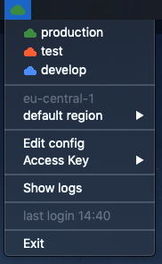

# logsmith
Logsmith is a desktop trayicon to assume your favorite aws roles.

```
“Who are you and how did you get in here?” -
”I'm a locksmith and i'm a locksmith”

- Police Squad! (1982)
```
 
## What does logsmith do?


- switch profiles 
- switch regions
- keeps you logged in
- removes unused profiles  
- icon will change color. You see which profiles you are using
- set and rotate access key
- write files with team name, account id and group name
- fetches mfa token for you

## Config
The config will be stored in `${HOME}/.logsmith/accounts.yaml` and should look like this:
```yaml
productive:                   
  team: team1                 
  region: eu-central-1         
  color: '#388E3C'            
  profiles:
    - profile: nonlive            
      account: 123456789123   
      role: developer         
      default: true            
    - profile: live
      account: 123456789123
      role: developer
```

## Access key
Please use the dialog option provided by logsmith to set your access key or save it in `.aws/credentials` 
under the profile name *access-key*.

```config
[access-key]
aws_access_key_id = blablubb
aws_secret_access_key = supersecret
```

## Switching region
Logsmith will use the `.aws/config` to set your region independent of your credentials in `.aws/credentials`. 

If the region in your config should be used if you don't specify a region in your aws call.

```config
[profile nonlive]
region = eu-central-1
output = json
```

## Mfa token
Logsmith can fetch mfa tokens from your yubikey if you have a suitable cli tools installed.

For example:
- ykman (mac)
- yubioath (linux)

On the logsmith config dialog, you can specify the appropriate command.
Please keep in mind that you have to provide the whole path/command, for example `/usr/local/bin/ykman oath code` .

## Support files
Inside of the applications config dialog you have the option to let logsmith write files, which you can then use in other scripts.
This can be useful if you work for multiple teams or in multiple accounts and want to export the account id to other applications/scripts. 

The files will be written to `.aws` to be somewhat decoupled from logsmith.

The options are as follows:
- write team to `.aws/active_team`
- write account id of the default profile to `.aws/active_account`
- write name of the profile group (eg. as the example above 'productive') to `.aws/active_group`

## How to package
If you want to build a binary, please use the following steps:

```bash
./setup.sh
./package.sh
```

The binary will be in `dist`.

### Mac
For mac, just drop the `dist/logsmith.app` in your application directory.

## Icons


This provided by [game-icons.net](https://game-icons.net/) and was made by [Lorc](http://lorcblog.blogspot.com/) under [CC BY 3.0](http://creativecommons.org/licenses/by/3.0/)

The icons in `app/assets` were provided by [material.io](https://material.io/resources/icons/?style=baseline) and are licenced under [Apache license version 2.0.](https://www.apache.org/licenses/LICENSE-2.0.html) 

## Contribute
logsmith is currently in active development and welcomes code improvements, bug fixes, suggestions and feature
requests. 

For those of your interested, providing documentation to other parties is equally welcome.

Please document all notable changes to this project in the provided changelog. Note that this project adheres to [Semantic Versioning](http://semver.org/).

## License
Distributed under the Apache License 2.0

## Known issues
- some desktop notifications are not shown
- sometimes dialogs will shown in the background
- (linux) the profile menu will not update (repaint) on config changes
- builds under OSX for linux using docker still missing the hidden imports for PyQt5.sip
