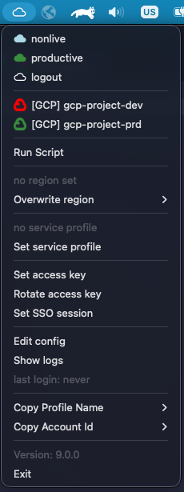
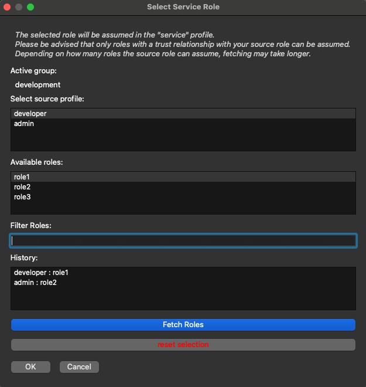

# logsmith

Logsmith is a desktop trayicon to:

- assume your favorite aws roles, and
- login & configure your gcloud config

```
“Who are you and how did you get in here?” -
”I'm a locksmith and i'm a locksmith”

- Police Squad! (1982)
```


## What does logsmith do?



- switch profiles
- switch regions
- keeps you logged in
- removes unused profiles
- custom icon color for each profile group
- set and rotate access key
- set sso session
- fetches mfa token
- comfortably assume service roles
- copy account ids and profile names
- run a script after login
- has a graphical user interface and a cli

## Application States


**Idle:** The app is running but no profile group is logged in yet. You can open the tray menu and trigger actions like login or configuration.


**Busy:** The app is performing a background task (login, refresh, script run). Inputs are temporarily disabled to avoid conflicting actions.


**Ready:** Login completed successfully and credentials are active. The cloud icon switches to the profile group’s configured color to show it’s ready to use.


**Impaired:** One or more profiles failed verification, so only part of the profile group is usable. The context menu lists which profiles are valid or invalid.


**Error:** A failure occurred (for example, invalid access-key or script error). Check the logs from the tray menu for the exact reason.

## Getting started


**Warning**: logsmith will write in your `.aws/credentials` and `./aws/config` files and it will remove unused profiles, this is a feature to "logout" the user.
This includes potential **access-keys** (which are profiles as well). If you have data in there that must not be lost, please back up the data beforehand.

Logsmith identifies **access-keys** if their profile name starts with `access-key` (e.g. `access-key` or `access-key-foo`) in `.aws/credentials` and will not remove them.
The same is true for **sso sessions**, which must start with `sso` in the `.aws/config` to not be removed.

Because boto3 does not natively support SSO login, the user must have the AWS CLI installed.

### Run from source

If you want to run logsmith from source, please use the following steps:

#### 1. Clone this repository

```bash
git clone https://github.com/otto-de/logsmith.git
cd logsmith
```

#### 2. Install the dependencies

```bash
./setup.sh
```

This will create a venv.

#### 3. Run application

```bash
./run.sh
```

After startup, a small cloud should appear in the start bar (this application has no main window).

#### 4. Add access-key or sso-session (aws)

Click on the cloud and select "Set access key" or "Set SSO Session".

A dialog will appear where you can add your data. Please be advised that an access-key must start with the prefix `access-key` and sso-sessions must start with `sso`.

The default name is simply `access-key` and `sso` respectively.

#### 5. Add configuration

To add your configuration for the accounts and profiles (aka profile groups) you want to login in, click on the cloud and select "Edit Config".

A dialog will appear where you can add your configuration in a text form. This config must be YAML conform, please see in the [Configuration](#Configuration) section down below for more instructions.

If you have used another name for your **access-key**, you may set it in the profile group, or you may set a default access-key name in the config dialog.

#### 6. Select a profile group

To start the login process, click on the cloud and select the profile group you want to login in, on success the cloud will change its color to the color you have set in the configuration. The login process will be repeated every 5 minutes to keep you logged in.

If an error occurs, the cloud icon will turn into a red bug. To see the error, click on the cloud and select "Show logs".

Be advised that in some cases a dialog may be opened in the background and will not appear in the taskbar.

### Homebrew

To install the latest stable version via homebrew use:

```
brew tap redvox/logsmith
brew install logsmith
```

Or install the latest beta version with:

```
brew install logsmith-beta
```

This will copy the binary into your Application folder. Start the application from there an follow the steps above from step 4.

## Configuration

The configuration is a YAML file that contains any number of profile groups. Each profile group can contain any number of profiles which will be assumed when the profile group is selected.

 **Warning**: If you have account ids with leading zeros, please make sure to put them in quotes, otherwise they will be interpreted as octal numbers.

Do not use **"access-key"**, **"sso"** or **"service"** (or anything with these as prefix) as profile names. These are reserved for access-keys, sso-sessions and service profiles.

Example configuration:

```yaml
productive: # profile group name (will be displayed)
  team: team1 # team name (used in support files)
  region: eu-central-1 # default region
  color: "#388E3C" # color code used to color the tray icon
  script: "some-script.sh" # script to run after login (optional)
  access_key: "access-key" # access-key name that this group should use (optional)
  sso_session: "sso-session" # sso-session name that this group should use (optional)
  sso_interval: "sso-interval" # renewal interval for sso in hours or 0 to deactivate refresh (optional)
  auth_mode: key # use either "key" or "sso" as auth modes
  write_mode: key # use key as write mode to write sso profiles as keys credentials (optional, per default write_mode = auth_mode)
  profiles:
    - profile: nonlive # local profile name
      account: "123456789123" # account id
      role: developer # role name that will be assumed
      default: true # flag if this profile should be the default profile (optional)
    - profile: live
      account: "987654321987"
      role: developer

# for google cloud:
#  - gcp project is the profile group name
#  - region and type are mandatory
#  - profiles section is no longer needed
gcp-project-dev:
  color: "#FF0000"
  team: team2
  region: europe-west1
  type: gcp

gcp-project-prd:
  color: "#388E3C"
  team: team2
  region: europe-west1
  type: gcp
```

This config will be stored in `${HOME}/.logsmith/accounts.yaml`.

### Google Cloud login

Click on the project that you want to use, this will trigger the typical login flow for user and application
credentials using browser.

If you have multiple browser profiles, please select the correct active browser.

The login flow will be automatically stopped after 60 seconds of inactivity or not completion.

It will trigger the login flow again after 8 hours.

### AWS Chain Assume

You may add a "source" profile which will be used to assume a given role.

This is useful when your want to assume specific service roles, but can not do so from your user directly.

```yaml
productive:
  team: team1
  region: eu-central-1
  color: "#388E3C"
  profiles:
    - profile: developer
      account: "123456789123"
      role: developer-role
    - profile: pipeline
      account: "123456789123"
      role: pipeline-role
      source: developer # source profile that will be used to assume 'pipeline-role'
```

In this example, logsmith will first assume the role 'developer-role', write the credentials in profile 'developer' and the uses the said profile to assume the role 'service-role'.

Please keep in mind that the roles will be assumed in the given order.

### Script

If a script is provided, it will be executed after the login process was successful.

You may also provide static arguments to the script path in your configuration.

Example:

```yaml
productive:
  script: "some-script.sh argument1 argument2"
```

## AWS Access key

Please use the dialog option provided by logsmith to set your access key or set it manually in `.aws/credentials`
under the profile name _access-key_.

```config
[access-key]
aws_access_key_id = blablubb
aws_secret_access_key = supersecret
```

The default session that is used by profiles with `auth_mode = key` is `access-key` (as seen in the example above), which can be changed in the config dialog.

If you want to use a different access-key then the default, you can specify it the field `access_key` in the profile group. Please note to use the prefix `access-key-` for a custom access-key.

## AWS SSO Session

Please use the dialog option provided by logsmith to set your sso session or set it manually in `.aws/config`
under the profile name _sso_.

```config
[sso-session sso]
sso_start_url = some-url
sso_region = some-region
sso_registration_scopes = some-scopes
```

The default session that is used by profiles with `auth_mode = sso` is `sso` (as seen in the example above), which can be changed in the config dialog.

If you want to use a different session, you can specify it the field `sso_session` in the profile group. Please note to use the prefix `sso-` for a custom sso-session.

## AWS Regions

Logsmith will use the `.aws/config` to set your region independent of your credentials in `.aws/credentials`.

```config
[profile nonlive]
region = eu-central-1
output = json
```

The region in your config will be used if you don't specify a region in your aws cli call or set AWS_REGION environment variable.

## Logout

If you choose the logout option under the profile groups, logsmith will remove all profiles (that do not start with **access-key** or **sso**) from your `.aws/credentials` and `.aws/config` files.

This can be useful if you want to restrict access to the AWS/GCP before running local tests.

## Mfa token

Logsmith can fetch mfa tokens from your yubikey if you have a suitable cli tool installed.

For example:

- ykman (mac)
- yubioath (linux)

On the logsmith config dialog, you can specify the appropriate command to fetch the token. Your command should return the 6 digit code.

Example:
`ykman oath accounts code  | awk 'NF>1{print $NF}'` .

## Service Profile

The Service Profile feature allows you to list and select roles that can be assumed with a given profile, allowing users to easily filter and select a role without needing to manually write role names.

Once a role is selected for a profile group, it is assumed in a standardized "service" profile. This can be used in your application to start them with the intended role, testing and debugging access rights without the need to deploy the application.

Because the role is always assumed in the "service" profile, it can be used across various applications with a standardised configuration.

The feature also remembers the last assumed role and automatically assumes it when the profile group is selected. Additionally, a history of recently used roles is included, making it quick to jump between roles as needed.



## Group file

Logsmith will write the active profile group to `${HOME}/.logsmith/active_group`. This could be used to include the current profile group in your shell prompt.

Example:

```bash
some_directory [master] (production) %
```

## Cli

If you provide one of the following parameter logsmith will automatically start in cli mode:

```bash
  --list                                  lists profile groups
  --login GROUP                           Login with group
  --logout                                Remove profiles
  --region REGION                         Overwrite region
  --set-access-key                        start dialog to set access key
  --rotate-access-key KEY_NAME            rotate access key
  --set-sso-session                       start dialog to set sso session
  --list-service-roles PROFILE            list assumable roles for the given profile
  --set-service-roles GROUP PROFILE ROLE  set service role for the given profile
  -o --oneshot                            exit after login
```

Example to login with cli mode:

```bash
  ./logsmith --login team1
```

## Create a binary

If you want to build a binary, please use the following steps:

#### 1. Install the dependencies

This will create a venv.

```bash
./setup.sh
```

#### 3. Build the binary

```bash
./package.sh
```

The binary will be in `dist`.

For Mac, copy the `dist/logsmith.app` in your application directory.

## Icons


This icon was provided by [game-icons.net](https://game-icons.net/) and was made by [Lorc](http://lorcblog.blogspot.com/) under [CC BY 3.0](http://creativecommons.org/licenses/by/3.0/)

The icons in `app/assets` were provided by [material.io](https://material.io/resources/icons/?style=baseline) and are licenced under [Apache license version 2.0.](https://www.apache.org/licenses/LICENSE-2.0.html)

## Contribute

logsmith is currently in active development and welcomes code improvements, bug fixes, suggestions and feature
requests.

For those of your interested, providing documentation to other parties is equally welcome.

Please document all notable changes to this project in the provided changelog under 'Unreleased' with usage of the provided format and categories.

Note that this project adheres to [Semantic Versioning](http://semver.org/).

## Releases

To create a new release, please use the following steps:

- update the CHANGELOG.md with the changes that will be in the release. Please use the provided format and categories to choose the new version number.
- update the version number in `app/__version__.py`.
- create a commit with the new version number as commit message which includes the changes mentioned above.
- Use the github action to create a release.
- Update the release description with the changes from the CHANGELOG.md.
- Publish the release.

### Yanking of releases

If a release is broken or contains security issues of any kind, it should be yanked.

If you want to yank a release, please use the following steps:

- update the release version to `yanked-<version>`.
- update github release name accordingly and delete the all uploaded files.
- update CHANGELOG.md accordingly and if possible, provide a reason.
- update commit tag accordingly.

## License

Distributed under Apache License 2.0

## Known issues

[Issues:Bug](https://github.com/otto-de/logsmith/labels/bug)
