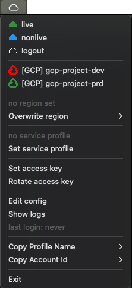

# logsmith
Logsmith is a desktop trayicon to:
- assume your favorite aws roles, and
- login & configure your gcloud config

```
“Who are you and how did you get in here?” -
”I'm a locksmith and i'm a locksmith”

- Police Squad! (1982)
```
 
## What does logsmith do?


- switch profiles 
- switch regions
- keeps you logged in
- removes unused profiles  
- icon will change color. You see which profiles you are using
- set and rotate access key
- fetches mfa token for you
- lets you quickly assume service roles
- has a graphical user interface and a cli

## Config
The config will be stored in `${HOME}/.logsmith/accounts.yaml` and should look like this:
```yaml
productive:                   
  team: team1                 
  region: eu-central-1         
  color: '#388E3C'            
  profiles:
    - profile: nonlive            
      account: '123456789123'   
      role: developer         
      default: true            
    - profile: live
      account: '123456789123'
      role: developer

# for google cloud:
#  - gcp project is the profile group name
#  - region and type are mandatory
#  - profiles section is no longer needed
gcp-project-dev:
  color: '#FF0000'
  team: team2
  region: europe-west1
  type: gcp

gcp-project-prd:
  color: '#388E3C'
  team: team2
  region: europe-west1
  type: gcp
```

If you have account ids with leading zeros, please make sure to put them in quotes.

### Google Cloud login
Click on the project that you want to use, this will trigger the typical login flow for user and application
credentials using browser. 

If you have multiple browser profiles, please select the correct active browser. 

The login flow will be automatically stopped after 60 seconds of inactivity or not completion.

It will trigger the login flow again after 8 hours.

### AWS Chain Assume
You may add a "source" profile which will be used to assume a given role.

This is useful when your want to assume specific service roles, but can not do so from your user directly. 

```yaml
productive:                   
  team: team1                 
  region: eu-central-1         
  color: '#388E3C'            
  profiles:
    - profile: developer            
      account: '123456789123'   
      role: developer-role         
    - profile: service
      account: '123456789123'
      role: service-role
      source: developer
```
In this example, logsmith will first assume the role 'developer-role', write the credentials in profile 'developer' and the uses the said profile to assume the role 'service-role'.

Please keep in mind that the roles will be assumed in the given order.

## AWS Access key
Please use the dialog option provided by logsmith to set your access key or save it in `.aws/credentials` 
under the profile name *access-key*.

```config
[access-key]
aws_access_key_id = blablubb
aws_secret_access_key = supersecret
```

## AWS Regions
Logsmith will use the `.aws/config` to set your region independent of your credentials in `.aws/credentials`. 

```config
[profile nonlive]
region = eu-central-1
output = json
```

The region in your config will be used if you don't specify a region in your aws cli call or set AWS_REGION environment variable.

## Mfa token
Logsmith can fetch mfa tokens from your yubikey if you have a suitable cli tool installed.

For example:
- ykman (mac)
- yubioath (linux)

On the logsmith config dialog, you can specify the appropriate command to fetch the token. Your command should return the 6 digit code.
Please also keep in mind that you might have to provide the whole path/command.

Example:
`/usr/local/bin/ykman oath accounts code  | awk 'NF>1{print $NF}'` .

## Service Profile
The Service Profile feature allows you to list and select roles that can be assumed with a given profile, allowing users to easily filter and select a role without needing to manually write role names. 

Once a role is selected for a profile group, it is assumed in a standardized "service" profile. This can be used in your application to start them with the intended role, testing and debugging access rights without the need to deploy the application.

Because the role is always assumed in the "service" profile, it can be used across various applications with a standardised configuration.

The feature also remembers the last assumed role and automatically assumes it when the profile group is selected. Additionally, a history of recently used roles is included, making it quick to jump between roles as needed.


## Group file
Logsmith will write the active profile group to `${HOME}/.logsmith/active_group`. This could be used to include the current profile group in your shell prompt.

Example:
```bash
some_directory [master] (production) %
```

## Cli
If you provide one of the following parameter logsmith will automatically start in cli mode:
```bash
  --list                                  lists profile groups
  --login GROUP                           Login with group
  --logout                                Remove profiles
  --region REGION                         Overwrite region to login to
  --set-access-key                        set access key
  --rotate-access-key KEY_NAME            rotate access key
  --list-service-roles PROFILE            list assumable roles for the given profile
  --set-service-roles GROUP PROFILE ROLE  set service role for the given profile
  -o --oneshot                            exit after login
```

Example to login with cli mode:
```bash
  ./logsmith --login team1
``` 

## How to package
If you want to build a binary, please use the following steps:

```bash
./setup.sh
./package.sh
```

The binary will be in `dist`.

### Mac
For mac, just drop the `dist/logsmith.app` in your application directory.

## Icons


This icon was provided by [game-icons.net](https://game-icons.net/) and was made by [Lorc](http://lorcblog.blogspot.com/) under [CC BY 3.0](http://creativecommons.org/licenses/by/3.0/)

The icons in `app/assets` were provided by [material.io](https://material.io/resources/icons/?style=baseline) and are licenced under [Apache license version 2.0.](https://www.apache.org/licenses/LICENSE-2.0.html) 

## Contribute
logsmith is currently in active development and welcomes code improvements, bug fixes, suggestions and feature
requests. 

For those of your interested, providing documentation to other parties is equally welcome.

Please document all notable changes to this project in the provided changelog under 'Unreleased' with usage of the provided format and categories.

Note that this project adheres to [Semantic Versioning](http://semver.org/).

## Releases
To create a new release, please use the following steps:

- update the CHANGELOG.md with the changes that will be in the release. Please use the provided format and categories to choose the new version number.
- update the version number in `app/__version__.py`.
- create a commit with the new version number as commit message which includes the changes mentioned above.
- tag the commit with the new version number.
- Use the github action to create a release.
- Update the release description with the changes from the CHANGELOG.md.
- Publish the release.

### Yanking of releases
If a release is broken or contains security issues of any kind, it should be yanked.

If you want to yank a release, please use the following steps:

- update the release version to `yanked-<version>`.
- update github release name accordingly and delete the all uploaded files.
- update CHANGELOG.md accordingly and if possible, provide a reason.
- update commit tag accordingly.

## License
Distributed under Apache License 2.0

## Known issues
[Issues:Bug](https://github.com/otto-de/logsmith/labels/bug)
